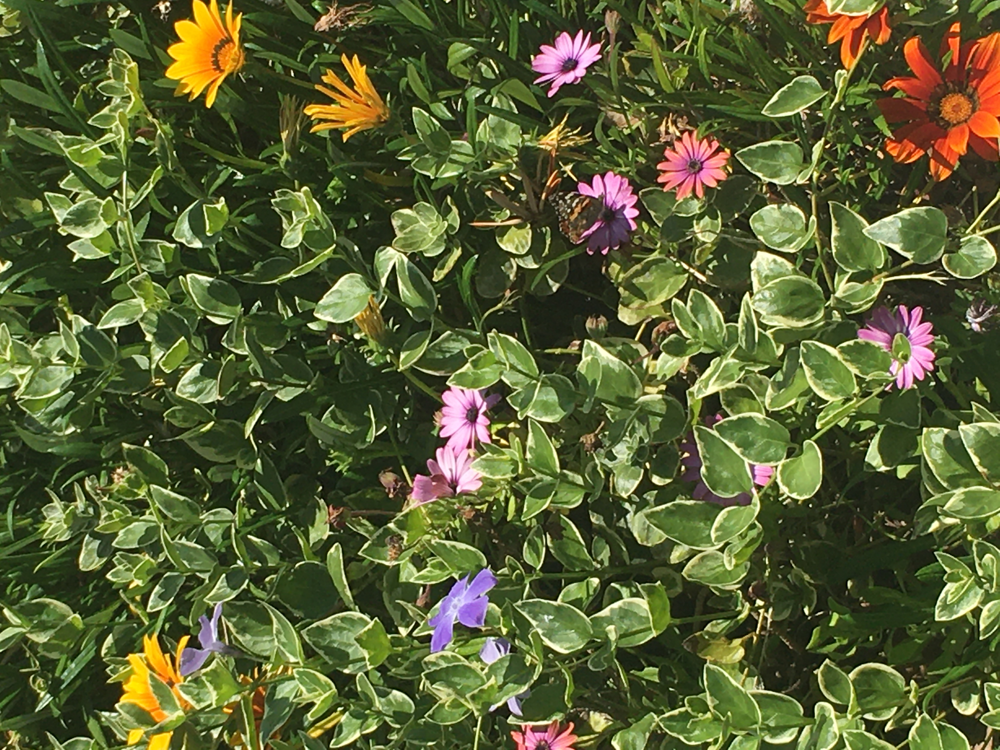

# Hello World
I am currently reading 'GitHub for Dummies' in order to learn this tool. As of now, I am a student at the University of La Verne working to recieve a B.S. in Computer Science with a concentration in Engineering. 

## My Goals
I hope to one day be a powerful female engineer. My current interests are environmental or software engineering. I am currently looking for internships to build my experience in the field.

## My Hobbies
I love to exercise my creativity through writing and art. In addition, nature has a big place in my heart. 

                                a photo I took recently while on a walk outside!
